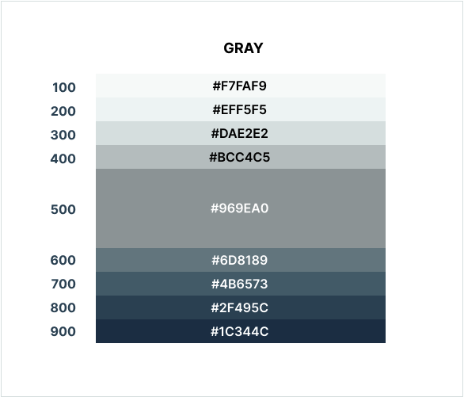
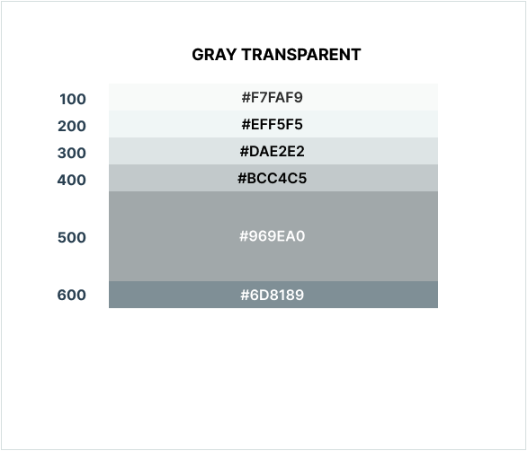

## Example of a page showing Color Usage

Colors Gray Normal            |  Colors Gray Light
:-------------------------:|:-------------------------:
  |  

Lorem ipsum dolor sit amet, consetetur sadipscing elitr, sed diam nonumy eirmod tempor invidunt ut labore et dolore magna aliquyam erat, sed diam voluptua. At vero eos et accusam et justo duo dolores et ea rebum. 

<DarkWrapper>

## Example on a Dark Background

Colors Gray Normal            |  Colors Gray Light
:-------------------------:|:-------------------------:
  |  

Lorem ipsum dolor sit amet, consetetur sadipscing elitr, sed diam nonumy eirmod tempor invidunt ut labore et dolore magna aliquyam erat, sed diam voluptua. At vero eos et accusam et justo duo dolores et ea rebum. 

</DarkWrapper>

Lorem ipsum dolor sit amet, consetetur sadipscing elitr, sed diam nonumy eirmod tempor invidunt ut labore et dolore magna aliquyam erat, sed diam voluptua. At vero eos et accusam et justo duo dolores et ea rebum. 

[Next: Typography](/1__documentation/1__typography/)

